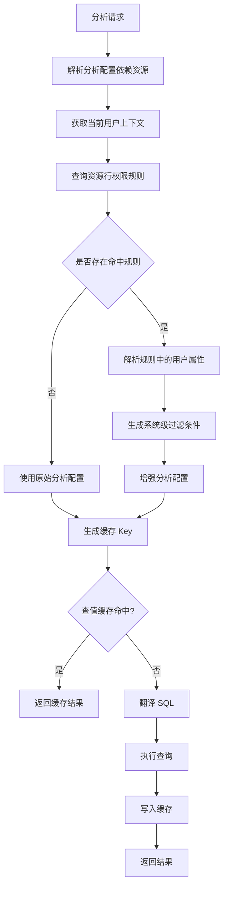

# 行权限模块详细设计文档

## 1. 背景与目标

当前用户行为分析系统基于资源 `resource` 配置分析条件、维度、度量，并将分析配置翻译为 SQL 执行查询。系统目前存在两类分析执行流程：

- **预跑流程**：前端提交完整分析配置表单，后端直接翻译为 SQL 并执行。
- **查值流程**：前端传入已保存配置的 `uuid`，后端查询配置详情，再翻译为 SQL 并执行。该流程存在缓存机制，缓存 key 当前主要依赖分析配置本身。

本次新增行权限能力，目标是：

1. 支持运营配置“部门-城市”映射，作为用户动态属性来源。
2. 支持运营按资源配置行权限规则，例如事件资源下配置“某些部门用户只能看自己城市的数据”。
3. 分析执行时，根据分析依赖的资源、当前用户、行权限规则，自动追加系统级过滤条件。
4. 查值缓存机制需要感知行权限变化和用户权限差异，避免跨用户、跨权限复用缓存导致越权。

## 2. 模块拆分

本次建议拆分为三个建设部分：

| 模块 | 目标 | 主要产物 |
| --- | --- | --- |
| 部门-城市映射配置 | 维护用户所属部门与可见城市关系 | 配置页面、CRUD 接口、用户属性查询能力 |
| 资源-行权限规则配置 | 基于资源配置行权限规则，并对外提供规则决策查询 | 资源列表、规则列表、规则编辑、行权限决策接口 |
| 分析后台适配 | 在预跑和查值流程中自动追加行权限过滤，并改造缓存 key | 分析增强服务、SQL 翻译适配、缓存 key 升级 |

这个拆分是合理的。第一部分解决“用户可以看哪些城市”的基础数据，第二部分解决“什么资源上有什么规则”，第三部分解决“规则如何真正作用到分析查询”。

## 3. 核心概念

### 3.1 资源 Resource

行为分析系统中的可分析对象，例如事件、汇总事件、宽表、指标集等。本期主要面向事件资源。

示例：

```text
resourceId = EV_001
resourceName = 全渠道用户行为埋点事件
resourceType = EVENT
```

### 3.2 行权限规则 Row Permission Rule

配置在某个资源上的数据过滤规则。规则主要包含：

- 权限名称
- 权限描述
- 授权对象
- 数据筛选规则
- 状态

示例：

```text
资源：EV_001 全渠道用户行为埋点事件
规则：分中心用户只能访问自己城市的数据
授权对象：部门ID包含 D001、D002
过滤规则：事件属性 city IN 当前用户属性 user.cityNames
```

### 3.3 授权对象 Subject

表示哪些用户会受到该行权限规则限制。

本期支持：

- 部门 / 科室
- 个人用户账号

注意：授权对象命中表示“该用户需要被追加此行权限过滤”，不是“只有这些用户能访问资源”。未命中授权对象的用户，不追加此条规则。

### 3.4 行权限过滤条件 Row Filter

最终会转换为分析查询的系统级过滤条件。

示例：

```text
city IN 当前用户属性 user.cityNames
```

运行时解析为：

```text
city IN (北京, 天津)
```

### 3.5 系统级过滤 System Filter

行权限产生的过滤条件不属于用户配置条件，应作为系统级过滤条件注入分析执行上下文。

建议分析内部模型区分：

```java
userFilters    // 用户在页面配置的条件
systemFilters  // 后端注入的行权限条件
```

最终 SQL 翻译时统一 AND：

```sql
WHERE 用户条件
  AND 行权限条件
```

## 4. 总体流程



## 5. 第一部分：部门-城市映射配置

### 5.1 建设目标

运营用户可以维护部门与城市的映射关系，用于行权限规则中的用户属性解析。

第一版需求：

```text
某部门用户只能查看该部门映射城市的数据
```

示例：

| 部门ID | 部门名称 | 城市 |
| --- | --- | --- |
| D001 | 北京分中心 | 北京 |
| D001 | 北京分中心 | 天津 |
| D002 | 杭州分中心 | 杭州 |

当用户属于“北京分中心”时，系统可解析：

```text
user.cityNames IN (北京, 天津)
user.cityCodes IN (110000, 120000)
```

### 5.2 页面能力

建议新增菜单：

```text
权限管理 / 部门城市映射
```

页面功能：

- 查询部门-城市映射列表
- 新增映射
- 编辑映射
- 删除映射
- 批量导入
- 批量导出
- 启停映射

列表字段：

| 字段 | 说明 |
| --- | --- |
| 部门ID | 对接组织中心的部门唯一标识 |
| 部门名称 | 展示名称 |
| 城市编码 | 城市唯一编码，建议使用标准行政区划编码或内部城市编码 |
| 城市名称 | 展示名称 |
| 状态 | ENABLED / DISABLED |
| 更新时间 | 最近修改时间 |
| 操作人 | 最近修改人 |

### 5.3 数据模型

表：`department_city_mapping`

| 字段 | 类型 | 说明 |
| --- | --- | --- |
| id | bigint | 主键 |
| department_id | varchar(64) | 部门ID |
| department_name | varchar(128) | 部门名称 |
| city_code | varchar(64) | 城市编码 |
| city_name | varchar(128) | 城市名称 |
| status | varchar(32) | ENABLED / DISABLED |
| created_by | varchar(64) | 创建人 |
| updated_by | varchar(64) | 更新人 |
| created_at | datetime | 创建时间 |
| updated_at | datetime | 更新时间 |

部门和城市支持一对多，一个部门可以映射多个城市。建议唯一索引：

```sql
UNIQUE KEY uk_department_city_mapping_department_city (department_id, city_code)
```

运营用户可以为同一个部门维护多条城市映射。部门ID和部门名称都需要保存，匹配时使用 `department_id`，`department_name` 仅用于页面展示和审计。

### 5.4 后端接口

#### 5.4.1 查询映射列表

```http
GET /api/row-permission/department-city-mappings
```

查询参数：

| 参数 | 说明 |
| --- | --- |
| departmentKeyword | 部门名称或部门ID |
| cityKeyword | 城市名称或城市编码 |
| status | 状态 |
| pageNo | 页码 |
| pageSize | 每页数量 |

#### 5.4.2 新增映射

```http
POST /api/row-permission/department-city-mappings
```

请求体：

```json
{
  "departmentId": "D001",
  "departmentName": "北京分中心",
  "cityCode": "110000",
  "cityName": "北京"
}
```

#### 5.4.3 编辑映射

```http
PUT /api/row-permission/department-city-mappings/{id}
```

#### 5.4.4 删除映射

```http
DELETE /api/row-permission/department-city-mappings/{id}
```

#### 5.4.5 启停映射

```http
PATCH /api/row-permission/department-city-mappings/{id}/status?status=ENABLED
```

### 5.5 用户属性解析

新增领域服务：

```java
public interface UserAttributeResolver {
    UserPermissionContext resolve(String userId);
}
```

返回：

```java
public class UserPermissionContext {
    private String userId;
    private List<String> departmentIds;
    private List<String> departmentNames;
    private Map<String, String> attributes;
}
```

当用户所属部门存在启用状态的城市映射时，需要聚合该用户所有部门映射出的城市集合：

```java
attributes.put("cityNames", cityNames);
attributes.put("cityCodes", cityCodes);
```

如果规则配置为 `city IN user.cityNames`，运行时解析为当前用户可见城市集合。匹配部门时使用部门ID，不使用部门名称。

### 5.6 变更影响

部门-城市映射变化会影响行权限决策结果。

建议做法：

- 当前用户上下文中的 `cityNames`、`cityCodes` 参与行权限缓存 hash。
- 如果部门城市映射变更，下一次请求解析出的城市集合不同，缓存 key 自然变化。

如需更强一致性，可维护 `userPermissionVersion` 或 `departmentCityMappingVersion`，但第一版可以先不做。

## 6. 第二部分：资源-行权限规则配置

### 6.1 建设目标

根据原型图实现资源与行权限规则配置能力：

1. 行权限资源列表。
2. 资源下行权限规则列表。
3. 行权限规则新增 / 编辑弹窗。
4. 对外提供根据 `resourceId + userId` 查询行权限决策结果的接口。

### 6.2 页面一：行权限资源列表

对应原型：“选择资源.jpg”。

页面字段：

| 字段 | 说明 |
| --- | --- |
| 资源ID | resourceId |
| 资源名称 | resourceName |
| 资源类型 | EVENT / SUMMARY |
| 已配行权限数 | 当前资源下规则数量 |
| 操作 | 配置行权限、删除 |

页面操作：

- 新增行权限资源
- 配置行权限
- 删除资源

### 6.3 页面二：资源下规则列表

对应原型：“资源下行权限的列表.jpg”。

页面字段：

| 字段 | 说明 |
| --- | --- |
| 规则名称 | ruleName |
| 状态 | ENABLED / DISABLED |
| 操作 | 编辑、删除、启停 |

页面操作：

- 新建行权限规则
- 编辑规则
- 删除规则
- 启停规则

### 6.4 页面三：规则配置弹窗

对应原型：“具体行权限的配置信息.jpg”。

表单字段：

| 字段 | 说明 |
| --- | --- |
| 权限名称 | 必填 |
| 权限描述 | 可选 |
| 授权用户组 | 支持部门 / 科室、个人用户账号 |
| 数据筛选规则 | 使用现有条件树组件，支持 AND / OR |

数据筛选规则沿用现有条件树模型，本设计不重新定义条件树能力。行权限模块只负责保存和运行时解析条件树中的用户属性引用。

示例：

```text
城市(city) IN 当前用户属性：可见城市集合(user.cityNames)
```

### 6.5 数据模型

#### 6.5.1 资源表

表：`row_permission_resource`

| 字段 | 类型 | 说明 |
| --- | --- | --- |
| id | bigint | 主键 |
| resource_id | varchar(64) | 资源ID |
| resource_name | varchar(128) | 资源名称 |
| resource_type | varchar(32) | 资源类型 |
| enabled | boolean | 是否启用 |
| rule_count | int | 冗余规则数 |
| created_at | datetime | 创建时间 |
| updated_at | datetime | 更新时间 |

#### 6.5.2 规则主表

表：`row_permission_rule`

| 字段 | 类型 | 说明 |
| --- | --- | --- |
| id | bigint | 主键 |
| resource_id | varchar(64) | 资源ID |
| rule_name | varchar(128) | 规则名称 |
| rule_description | varchar(512) | 规则描述 |
| status | varchar(32) | ENABLED / DISABLED |
| created_at | datetime | 创建时间 |
| updated_at | datetime | 更新时间 |

#### 6.5.3 授权对象表

表：`row_permission_rule_subject`

| 字段 | 类型 | 说明 |
| --- | --- | --- |
| rule_id | bigint | 规则ID |
| subject_type | varchar(32) | DEPARTMENT / USER_ACCOUNT |
| subject_value | varchar(128) | 部门ID或用户ID |
| subject_name | varchar(128) | 部门名称或用户名称，用于展示和审计 |

部门ID和名称都需要保存。匹配时必须使用 `subject_value` 中的部门ID，`subject_name` 不参与权限判断。

#### 6.5.4 过滤表达式表

表：`row_permission_rule_filter`

| 字段 | 类型 | 说明 |
| --- | --- | --- |
| rule_id | bigint | 规则ID |
| sort_order | int | 条件顺序 |
| field_name | varchar(128) | 资源属性名，如 city |
| field_label | varchar(128) | 展示名 |
| operator | varchar(32) | EQ / IN 等 |
| right_type | varchar(32) | LITERAL / USER_ATTRIBUTE |
| right_value | varchar(256) | 常量值或用户属性名，如 city |
| right_label | varchar(128) | 展示名 |

### 6.6 DDD 分层建议

建议继续使用当前框架中的分层：

```text
rowpermission
  domain
    model
    repository
    service
  application
    dto
    command
    service
  infrastructure
    persistence
    client
  interfaces
    rest
```

领域对象：

- `RowPermissionResource`
- `RowPermissionRule`
- `AuthorizedSubject`
- `RowFilterExpression`
- `UserPermissionContext`

应用服务：

- `RowPermissionAdminApplicationService`
- `RowPermissionDecisionApplicationService`
- `DepartmentCityMappingApplicationService`

### 6.7 管理接口

#### 6.7.1 资源列表

```http
GET /api/row-permission/resources
```

#### 6.7.2 新增资源

```http
POST /api/row-permission/resources
```

#### 6.7.3 资源下规则列表

```http
GET /api/row-permission/resources/{resourceId}/rules
```

#### 6.7.4 新增规则

```http
POST /api/row-permission/resources/{resourceId}/rules
```

请求体示例：

```json
{
  "ruleName": "分中心用户背对背访问",
  "ruleDescription": "分中心用户只能访问自己所在城市的数据",
  "subjects": [
    {
      "subjectType": "DEPARTMENT",
      "values": ["D001", "D002"]
    }
  ],
  "filterConditions": [
    {
      "fieldName": "city",
      "fieldLabel": "城市",
      "operator": "IN",
      "rightType": "USER_ATTRIBUTE",
      "rightValue": "cityNames",
      "rightLabel": "当前用户属性：可见城市集合"
    }
  ],
  "status": "ENABLED"
}
```

#### 6.7.5 编辑规则

```http
PUT /api/row-permission/rules/{ruleId}
```

#### 6.7.6 启停规则

```http
PATCH /api/row-permission/rules/{ruleId}/status?status=DISABLED
```

#### 6.7.7 删除规则

```http
DELETE /api/row-permission/rules/{ruleId}
```

### 6.8 对外查询接口

分析后台接入时，不建议直接查规则表。应提供稳定的行权限决策接口。

#### 6.8.1 单资源查询

```http
GET /api/row-permission/decisions?resourceId=EV_001&userId=U001
```

返回：

```json
{
  "resourceId": "EV_001",
  "userId": "U001",
  "matched": true,
  "matchedRuleIds": [1001],
  "filters": [
    {
      "fieldName": "city",
      "operator": "IN",
      "value": ["北京", "天津"],
      "source": "ROW_PERMISSION"
    }
  ],
  "policyVersion": "EV_001:12",
  "fingerprint": "sha256..."
}
```

#### 6.8.2 多资源批量查询

分析场景通常依赖多个资源，建议提供批量接口，避免 N 次 RPC / HTTP 调用。

```http
POST /api/row-permission/decisions/batch
```

请求：

```json
{
  "resourceIds": ["EV_001", "EV_002"],
  "userId": "U001"
}
```

返回：

```json
{
  "userId": "U001",
  "resourceDecisions": [
    {
      "resourceId": "EV_001",
      "matchedRuleIds": [1001],
      "filters": [
        {
          "fieldName": "city",
          "operator": "IN",
          "value": ["北京", "天津"],
          "source": "ROW_PERMISSION"
        }
      ],
      "policyVersion": "EV_001:12"
    },
    {
      "resourceId": "EV_002",
      "matchedRuleIds": [],
      "filters": [],
      "policyVersion": "EV_002:3"
    }
  ],
  "combinedFingerprint": "sha256..."
}
```

### 6.9 安全兜底策略

如果用户命中授权对象，但规则需要的用户属性不存在，例如：

```text
city IN user.cityNames
```

但当前用户上下文中没有 `cityNames`，则不能放行。

建议生成永不命中的过滤条件：

```text
city = __ROW_PERMISSION_DENY_ALL__
```

这样结果为空，避免因用户属性缺失造成越权。

### 6.10 resourcePolicyVersion

建议维护资源级行权限版本：

表：`row_permission_resource_policy_version`

| 字段 | 类型 | 说明 |
| --- | --- | --- |
| resource_id | varchar(64) | 资源ID |
| version | bigint | 版本号 |
| updated_at | datetime | 更新时间 |

每次某资源下发生以下变更时递增：

- 新增规则
- 编辑规则
- 删除规则
- 启停规则
- 修改授权对象
- 修改过滤表达式

用途：

- 放入行权限决策结果。
- 参与分析查值缓存 key。
- 行权限规则变化后，旧缓存自然失效。

## 7. 第三部分：分析后台适配

### 7.1 建设目标

分析后台在预跑和查值流程中，都需要根据分析配置依赖的资源追加行权限过滤。

接入目标：

1. 预跑流程支持行权限。
2. 查值流程支持行权限。
3. SQL 翻译器统一处理用户过滤和系统过滤。
4. 查值缓存 key 感知行权限差异。
5. 规则变更后相关缓存自然失效。

### 7.2 接入位置

行权限应在 SQL 翻译前介入：

```text
AnalysisConfig
  -> ResourceExtractor
  -> RowPermissionDecision
  -> AnalysisConfigEnhancer
  -> SQL Translator
  -> Query Executor
```

不建议在 SQL 翻译器底层临时查行权限，因为这样会导致：

- 预跑和查值逻辑分散。
- 缓存 key 无法提前感知行权限。
- SQL 翻译器职责膨胀。

### 7.3 新增核心服务

#### 7.3.1 资源提取器

```java
public interface AnalysisResourceExtractor {
    List<String> extractResourceIds(AnalysisConfig config);
}
```

职责：

- 从分析配置中提取依赖资源。
- 包括事件、关联事件、漏斗步骤、留存事件等场景。

#### 7.3.2 行权限增强器

```java
public class AnalysisRowPermissionEnhancer {

    public EnhancedAnalysisConfig enhance(AnalysisConfig config, UserContext userContext) {
        List<String> resourceIds = resourceExtractor.extractResourceIds(config);
        RowPermissionDecision decision = decisionService.decide(resourceIds, userContext);
        AnalysisConfig enhancedConfig = config.copy();
        enhancedConfig.addSystemFilters(decision.getFilters());
        return new EnhancedAnalysisConfig(enhancedConfig, decision);
    }
}
```

输出：

```java
public class EnhancedAnalysisConfig {
    private AnalysisConfig config;
    private RowPermissionDecision rowPermissionDecision;
}
```

#### 7.3.3 系统过滤模型

建议分析配置内部新增：

```java
private List<QueryFilter> userFilters;
private List<QueryFilter> systemFilters;
```

如果现有模型短期难改，可在翻译 SQL 前构造临时执行模型：

```java
AnalysisExecutionContext {
    AnalysisConfig originalConfig;
    List<QueryFilter> appendedSystemFilters;
}
```

不要把行权限过滤条件写回数据库中的配置表。

### 7.4 预跑流程设计

现有流程：

```text
前端提交完整表单
-> 后端解析表单
-> 翻译 SQL
-> 执行查询
```

改造后：

```text
1. 前端提交完整表单 AnalysisForm
2. 后端转换为 AnalysisConfig
3. ResourceExtractor 提取 resourceIds
4. 获取当前登录用户上下文
5. RowPermissionDecisionService 批量查询资源行权限决策
6. 将行权限过滤注入 systemFilters
7. SQL Translator 翻译增强后的配置
8. 执行查询
9. 返回结果
```

伪代码：

```java
public AnalysisResult preview(AnalysisPreviewRequest request) {
    AnalysisConfig config = analysisFormConverter.convert(request.getForm());
    UserContext userContext = currentUserContextProvider.get();

    EnhancedAnalysisConfig enhanced = rowPermissionEnhancer.enhance(config, userContext);

    SqlQuery sqlQuery = sqlTranslator.translate(enhanced.getConfig());
    return queryExecutor.execute(sqlQuery);
}
```

预跑流程不使用缓存，必须基于当前配置、当前行权限规则和最新底层数据实时查询。

### 7.5 查值流程设计

现有流程：

```text
传入 uuid
-> 查询配置详情
-> 根据配置生成缓存 key
-> 命中缓存返回
-> 未命中则翻译 SQL
-> 执行查询并写缓存
```

改造后：

```text
1. 接收 uuid 和查询参数
2. 查询 AnalysisConfig
3. 获取当前用户上下文
4. 行权限增强
5. 生成包含行权限 fingerprint 的缓存 key
6. 命中缓存返回
7. 未命中则翻译 SQL
8. 执行查询
9. 写入缓存
```

伪代码：

```java
public AnalysisResult queryValue(QueryValueRequest request) {
    AnalysisConfig config = configRepository.findByUuid(request.getUuid());
    UserContext userContext = currentUserContextProvider.get();

    EnhancedAnalysisConfig enhanced = rowPermissionEnhancer.enhance(config, userContext);

    String cacheKey = analysisCacheKeyBuilder.build(
        config,
        request,
        enhanced.getRowPermissionDecision()
    );

    return cache.getOrLoad(cacheKey, () -> {
        SqlQuery sqlQuery = sqlTranslator.translate(enhanced.getConfig());
        return queryExecutor.execute(sqlQuery);
    });
}
```

### 7.6 缓存机制设计

#### 7.6.1 当前问题

当前查值缓存 key 主要依赖分析配置本身。

接入行权限后，如果仍然只依赖配置，会出现以下风险：

```text
同一配置 uuid
A 用户 cityNames = [北京, 天津]
B 用户 cityNames = [杭州]

如果缓存 key 相同，B 用户可能拿到 A 用户的查询结果。
```

这是严重越权风险。

#### 7.6.2 新缓存 key 结构

建议缓存 key 从：

```text
analysis:data:{configHash}:{requestHash}
```

升级为：

```text
analysis:data:{configHash}:{requestHash}:{rowPermissionHash}
```

其中：

| 部分 | 说明 |
| --- | --- |
| configHash | 分析配置内容 hash，包含维度、指标、用户条件、资源等 |
| requestHash | 查询参数 hash，例如时间范围、分页、排序 |
| rowPermissionHash | 当前用户在当前资源集合下的行权限决策 hash |

#### 7.6.3 rowPermissionHash 内容

建议包含：

```text
resourceIds
resourcePolicyVersions
userId
matchedRuleIds
resolvedRowFilters
usedUserAttributes
```

示例：

```text
resources=EV_001,EV_002
policyVersions=EV_001:12|EV_002:3
userId=U001
matchedRuleIds=1001
filters=EV_001.city IN [北京,天津]
usedUserAttributes=cityNames:[北京,天津]
```

然后取 SHA-256：

```text
rowPermissionHash = sha256(canonicalString)
```

#### 7.6.4 为什么需要 resourcePolicyVersion

`resourcePolicyVersion` 是缓存一致性字段。

如果某个资源下的行权限规则发生变化：

```text
EV_001 version 12 -> 13
```

则查值缓存 key 中的行权限部分也会变化：

```text
analysis:data:{configHash}:{requestHash}:{hash(EV_001:12)}
analysis:data:{configHash}:{requestHash}:{hash(EV_001:13)}
```

旧缓存自然不再命中，不需要扫描 Redis 删除缓存。

资源级版本比全局版本更精准：

- EV_001 规则变化，只影响依赖 EV_001 的分析缓存。
- EV_002 相关缓存不受影响。

#### 7.6.5 缓存失效策略

推荐策略：

```text
版本入 key，自然失效，TTL 清理旧缓存
```

不建议行权限规则变更后主动扫描删除缓存，因为：

- Redis key 数量可能很大。
- 分析配置与资源依赖关系复杂。
- 删除成本和误删风险较高。

TTL 策略：

- 暂不调整现有查值缓存过期时间。
- 行权限通过 `rowPermissionHash` 和 `resourcePolicyVersion` 进入 key，实现规则变更后的自然失效。

#### 7.6.6 无规则场景

即使资源没有规则，也建议 rowPermissionHash 包含资源版本：

```text
EV_001:0
```

这样当后续运营给 EV_001 新增第一条规则时：

```text
EV_001:0 -> EV_001:1
```

原先无权限过滤的缓存自然失效。

### 7.7 SQL 翻译适配

SQL 翻译器需要支持系统级过滤条件。

输入：

```java
AnalysisExecutionContext {
    AnalysisConfig config;
    List<QueryFilter> userFilters;
    List<QueryFilter> systemFilters;
}
```

输出 SQL：

```sql
SELECT ...
FROM event_table e
WHERE 1 = 1
  AND 用户配置条件
  AND 行权限系统条件
GROUP BY ...
```

如果多资源 SQL 存在不同表别名，需要在行权限过滤注入时保留 `resourceId`：

```java
class QueryFilter {
    private String resourceId;
    private String fieldName;
    private Operator operator;
    private Object value;
    private FilterSource source;
}
```

SQL 翻译阶段根据：

```text
resourceId + fieldName
```

映射到物理字段：

```text
e.city
```

### 7.8 多资源规则合并

如果分析配置依赖多个资源：

```text
EV_001 命中 city IN [北京, 天津]
EV_002 命中 org_id IN (...)
```

默认合并方式为 AND：

```text
用户条件
AND EV_001 行权限条件
AND EV_002 行权限条件
```

注意：

- 同一个资源多条规则命中时，多个规则之间必须 AND。
- 单条规则内部的过滤条件沿用现有条件树，条件树本身可以表达 AND / OR，行权限接入层不重新设计条件树语义。

本期规则组合语义：

```text
规则内：按现有条件树语义执行，支持 AND / OR
多条命中规则：AND
多资源规则：AND
```

这样可以复用现有条件树能力，同时保证多规则叠加时权限更收敛。

### 7.9 审计与排查

建议查询日志中记录：

| 字段 | 说明 |
| --- | --- |
| analysisUuid | 分析配置ID |
| userId | 查询用户 |
| resourceIds | 依赖资源 |
| matchedRuleIds | 命中的规则 |
| rowPermissionHash | 行权限 hash |
| cacheKey | 最终缓存 key |
| sqlTraceId | SQL 执行 trace |

排查越权或数据疑问时，可以通过这些信息还原：

- 当前用户命中了哪些规则。
- 追加了哪些系统过滤。
- 是否命中缓存。
- 命中的缓存是否与当前行权限版本一致。

## 8. 兼容性与迁移

### 8.1 对现有分析配置

不修改历史分析配置内容。

行权限只在运行时注入：

```text
原始配置保持不变
执行上下文临时增强
```

### 8.2 对现有缓存

上线后由于缓存 key 结构变化，旧缓存不会被新流程命中。

可选方案：

1. 允许旧缓存自然过期。
2. 上线时清理分析查值缓存 namespace。

如果现有缓存 namespace 不区分版本，建议新 key 增加版本前缀：

```text
analysis:data:v2:{configHash}:{requestHash}:{rowPermissionHash}
```

### 8.3 对现有 SQL 翻译器

需要支持系统过滤条件：

- 如果翻译器已有统一 Filter 模型，只新增 `source` 字段。
- 如果当前直接从配置中读取用户条件，需要增加执行上下文对象承载追加条件。

## 9. 异常处理

### 9.1 用户属性缺失

用户命中规则但属性缺失：

```text
city IN user.cityNames
```

解析不到 `user.cityNames` 时，生成 deny-all 条件：

```text
city = __ROW_PERMISSION_DENY_ALL__
```

并记录告警日志。

### 9.2 条件树解析失败

规则过滤条件沿用现有条件树。如果运行时条件树解析失败、用户属性无法替换、操作符不兼容，应阻断查询并记录告警，不应静默跳过该规则。

资源属性能力由其他现有项目提供，本设计不覆盖资源属性元数据建设。

### 9.3 行权限服务异常

分析查询时行权限决策失败。

建议默认策略：

```text
失败阻断查询
```

原因：行权限属于安全能力，不能因为服务异常而放行。

返回错误：

```text
行权限校验失败，请稍后重试
```

## 10. 权限与操作控制

行权限配置页面需要操作权限控制：

| 操作 | 权限点 |
| --- | --- |
| 查看资源 | row-permission:resource:view |
| 新增资源 | row-permission:resource:create |
| 删除资源 | row-permission:resource:delete |
| 查看规则 | row-permission:rule:view |
| 新增规则 | row-permission:rule:create |
| 编辑规则 | row-permission:rule:update |
| 删除规则 | row-permission:rule:delete |
| 启停规则 | row-permission:rule:status |
| 部门城市映射管理 | row-permission:department-city:* |

## 11. 开发任务拆解

### 11.1 部门-城市映射

后端：

- 建表 `department_city_mapping`
- CRUD 接口
- 批量导入 / 导出接口
- 用户属性解析服务
- 单元测试 / 接口测试

前端：

- 列表页
- 新增 / 编辑弹窗
- 删除确认
- 导入 / 导出
- 权限点接入

### 11.2 资源-行权限规则配置

后端：

- 资源管理接口
- 规则管理接口
- 规则保存校验
- 规则决策接口
- `resourcePolicyVersion` 维护
- 行权限 fingerprint 生成
- 单测覆盖命中 / 未命中 / 属性缺失 / 规则启停

前端：

- 资源列表页
- 资源下规则列表弹窗
- 新增 / 编辑规则弹窗
- 授权对象选择器
- 用户属性选择器

### 11.3 分析后台适配

后端：

- 资源提取器
- 行权限增强器
- 预跑流程接入
- 查值流程接入
- 缓存 key 升级
- SQL 翻译器支持 systemFilters
- 查询审计日志
- 集成测试

## 12. 测试场景

### 12.1 规则配置

- 新增资源成功。
- 同 resourceId 重复新增失败。
- 新增规则成功。
- 授权对象为空保存失败。
- 过滤条件为空保存失败。
- 禁用规则后不再生效。
- 删除规则后 resourcePolicyVersion 递增。

### 12.2 部门城市映射

- 用户部门映射到多个城市后，可解析 `user.cityNames` / `user.cityCodes` 集合。
- 匹配授权对象时使用部门ID。
- 部门无映射时，命中规则生成 deny-all。
- 映射禁用后不再解析。

### 12.3 预跑流程

- 用户命中规则，SQL 自动追加城市过滤。
- 用户未命中规则，SQL 不追加行权限过滤。
- 多资源命中多条规则，SQL 全部追加。
- 单条规则内部 OR 条件按现有条件树语义翻译。
- 用户属性缺失，SQL 查询结果为空。
- 预跑不读写缓存，始终查最新数据。

### 12.4 查值流程与缓存

- 同一配置、不同城市用户，缓存 key 不同。
- 同一配置、同一用户，重复查询命中缓存。
- 修改规则后 resourcePolicyVersion 递增，旧缓存不命中。
- 新增第一条规则后，原无规则缓存不命中。
- 禁用规则后，缓存 key 变化。

## 13. 上线建议

建议分阶段上线：

### 阶段一：配置能力上线

- 上线部门-城市映射配置。
- 上线资源-规则配置。
- 暂不接入分析执行，仅验证配置和决策接口。

### 阶段二：灰度接入预跑

- 预跑流程接入行权限。
- 通过 SQL 日志和结果校验规则是否符合预期。

### 阶段三：灰度接入查值

- 查值流程接入行权限。
- 启用新缓存 key。
- 观察缓存命中率、查询耗时和错误率。

### 阶段四：全量上线

- 配置审计日志。
- 监控行权限决策失败率。
- 监控 deny-all 命中次数。

## 14. 已确认事项

以下事项已确认并写入本设计：

1. 部门和城市支持一对多，由运营用户配置。
2. 部门ID和名称都保存，权限匹配使用部门ID。
3. 规则不按系统维度限制，只按资源和用户判断。
4. 多个命中规则之间 AND。
5. 单条规则过滤条件沿用现有条件树，条件树本身支持 OR，本设计不重新实现条件树。
6. 查值缓存过期时间暂不调整。
7. 预跑不使用缓存，必须查最新数据。
8. 资源属性能力由现有项目提供，本设计不覆盖资源属性元数据建设。
9. 行权限异常处理按安全优先策略执行，不能静默放行。
